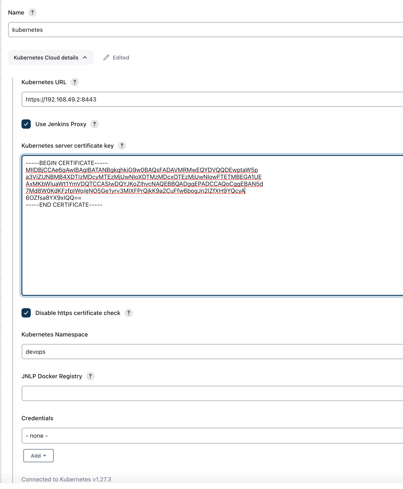

# home_check

# create namespace devops and arca:

kubectl create namespace devops

kubectl create namespace arca

# Create Jenkins Image:

FROM jenkins/jenkins:lts
USER root
RUN apt-get update && \
    apt-get install -y wget && \
    wget https://packages.microsoft.com/config/debian/10/packages-microsoft-prod.deb -O packages-microsoft-prod.deb && \
    dpkg -i packages-microsoft-prod.deb && \
    apt-get update && \
    apt-get install -y apt-transport-https && \
    apt-get update && \
    apt-get install -y dotnet-sdk-5.0

RUN apt-get update && \
    apt-get install -y apt-transport-https curl && \
    curl -s https://packages.cloud.google.com/apt/doc/apt-key.gpg | apt-key add - && \
    echo "deb https://apt.kubernetes.io/ kubernetes-xenial main" | tee -a /etc/apt/sources.list.d/kubernetes.list && \
    apt-get update && \
    apt-get install -y kubectl

USER jenkins

Docker image with k8s and dotnet cli installed

# Install Jenkins and jenkins - slave
Helm with values.yaml:
helm install jenkins jenkinsci/jenkins -f values.yaml -n devops

in this step we install jenkins main and worker with plugins we need

# Add Roles for grant access for Jenkins Pod to different workspaces in out case arca
kubectl apply -f role-arca.yaml -f rolebinding-arca.yaml

# Jenkins create Git and Docker Credentials

# Jenkins connect to K8S 

# Create git repo 
https://github.com/VladimirKogan/dot-net-test-app

# Jenkins Create Job
Create Job type pipeline

Instead jenkins pipleline choose
Pipeline script from SCM and connect to https://github.com/VladimirKogan/dot-net-test-app.git
